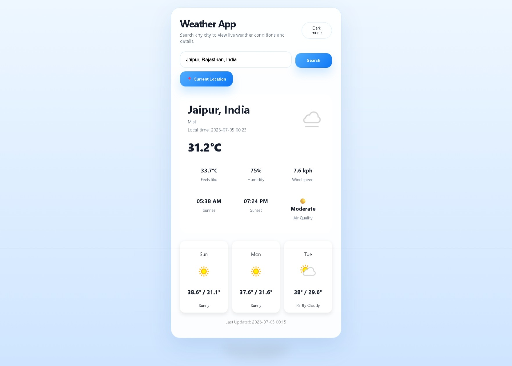
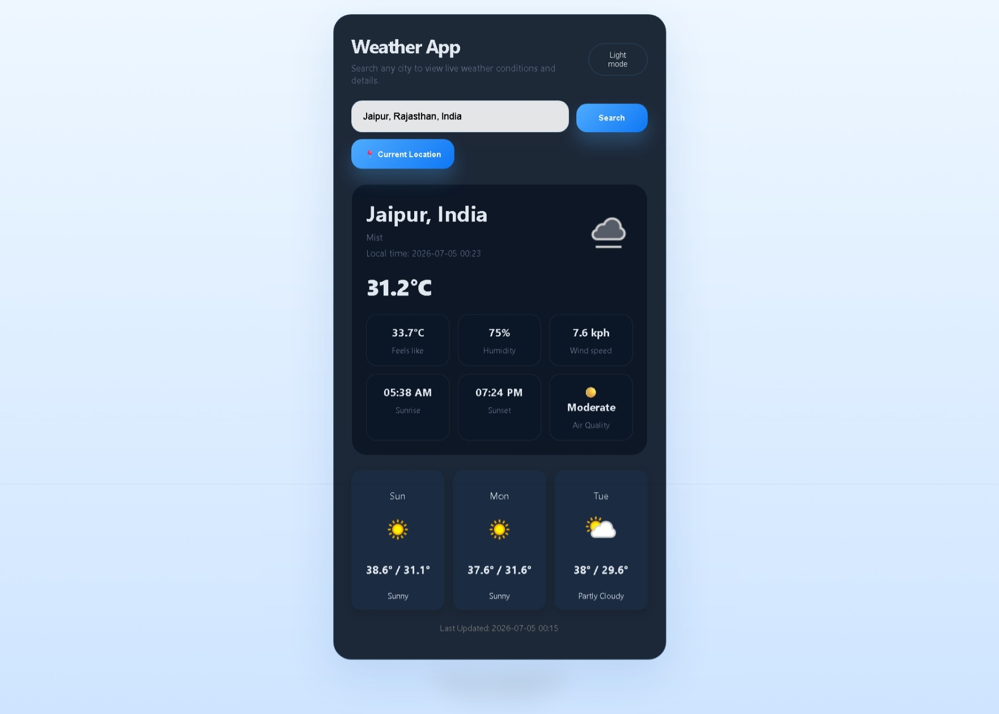

# 🌦️ Weather App

A modern and responsive Weather Application built using **HTML, CSS, and JavaScript**.

It provides real-time weather information, 7-day forecast, air quality index (AQI), city search with autocomplete suggestions, current location support, dark/light mode, and dynamic weather backgrounds.

## 🚀 Live Demo

🔗 https://tapishbhardwaj.github.io/weather-app/

## ✨ Features

- 🌍 Search weather by city
- 📍 Current location weather
- 🔎 City autocomplete suggestions
- 🌡️ Real-time temperature
- 🤗 Feels Like temperature
- 💧 Humidity
- 🌬️ Wind Speed
- 🌫️ Air Quality Index (AQI)
- 📅 7-Day Weather Forecast
- 🌙 Dark / Light Mode
- 🎨 Dynamic Background
- 📱 Responsive Design

## 🛠️ Technologies Used

- HTML5
- CSS3
- JavaScript (ES6)
- Fetch API
- WeatherAPI
- Open-Meteo Geocoding API
- Geolocation API
- Git & GitHub

## 📚 APIs Used

### WeatherAPI
- Current Weather
- 7-Day Forecast
- Air Quality Index (AQI)

### Open-Meteo Geocoding API
- City Search
- Autocomplete Suggestions

### Browser Geolocation API
- Current Location Weather

## ⚙️ Installation

1. Clone the repository

```bash
git clone https://github.com/tapishbhardwaj/weather-app.git
```

2. Open the project folder.

3. Open `index.html` in your browser.

## 📂 Project Structure

```
weather-app/
│
├── index.html
├── style.css
├── script.js
├── README.md
└── screenshots/
```

## 👨‍💻 Author

**Tapish Bhardwaj**

- GitHub: https://github.com/tapishbhardwaj

If you like this project, consider giving it a ⭐ on GitHub!

## 📸 Screenshots

### ☀️ Light Mode



### 🌙 Dark Mode

